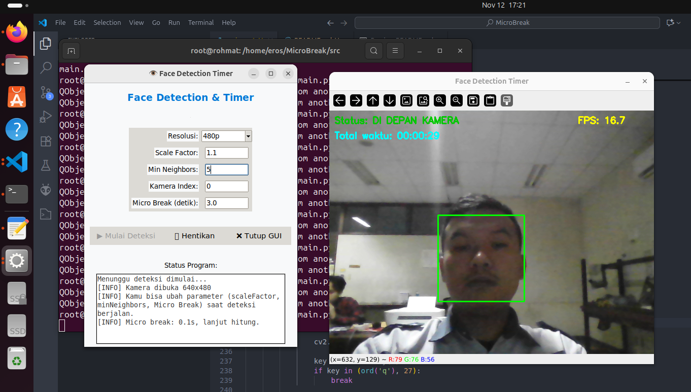
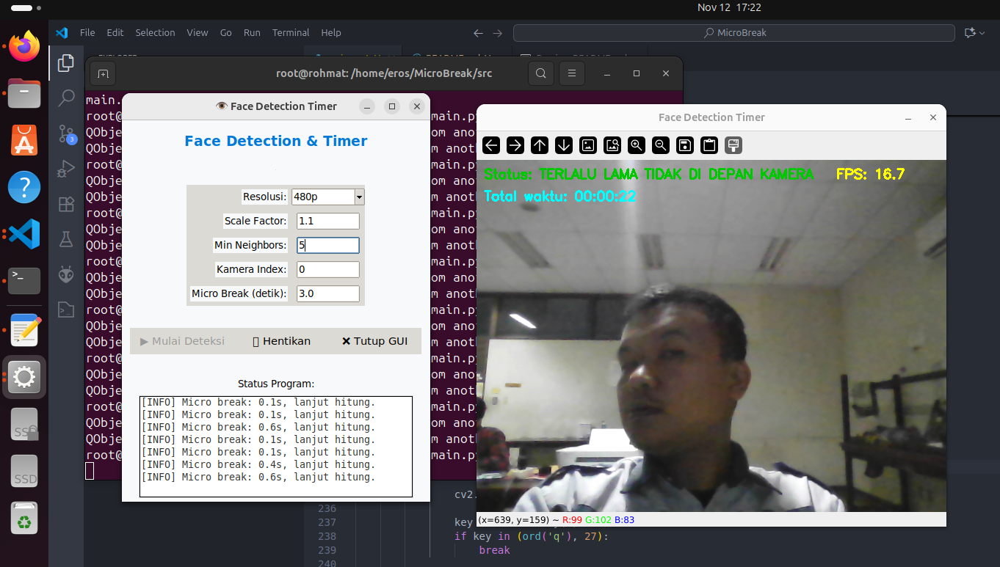

# MicroBreak Detection 😴

Proyek ini bertujuan untuk mendeteksi keberadaan wajah di depan kamera dan menghitung waktu istirahat singkat (micro break) secara otomatis menggunakan metode Haar Cascade (Viola–Jones).
Aplikasi ini dapat membantu pengguna, terutama pekerja komputer atau pelajar, agar tidak terlalu lama menatap layar dan tetap menjaga kesehatan mata serta postur tubuh.
## Support By :
>- Dosen Pengampu : Akhmad Hendriawan ST., MT. (NIP.197501272002121003)
>- Mata kuliah : Pengolahan Citra
>- Program Studi : D4 Teknik Elektronika
>- Politeknik Elektronika Negeri Surabaya  

## Teamwork
> 1. Nur Rohmat Hidayat (2122600012)
> 2. Fadlan Surya Anindita (2122600024)
> 3. Dwi Angga Ramadhani (2122600053)
> 4. Asyraf Sulthan Zaky (2122600060)

## Viola-Jones Haar Cascade

Metode ini digunakan untuk mendeteksi keberadaan wajah di depan kamera secara real-time. Dengan pendekatan berbasis fitur (feature-based detection), Haar Cascade mampu mengenali pola wajah manusia dari citra kamera untuk menentukan apakah pengguna sedang berada di depan komputer atau sedang beristirahat (micro break).

## Kelebihan:

- Implementasi sederhana dan komputasi relatif ringan
- Deteksi wajah cukup cepat untuk sistem real-time
- Cocok untuk aplikasi monitoring aktivitas pengguna seperti MicroBreak Detection
- Mudah diintegrasikan dengan GUI (Tkinter) untuk interaksi pengguna

## Kelemahan:

- Sensitif terhadap perubahan pencahayaan dan posisi wajah
- Akurasi menurun bila wajah tertutup sebagian atau pencahayaan tidak stabil
- Sulit mendeteksi wajah dengan variasi pose (miring, menunduk, dsb)

Rentan terjadi false negative saat pengguna menjauh dari kamera atau kondisi cahaya rendah
## 🚀 Fitur Utama
- Deteksi wajah secara real-time menggunakan OpenCV Haar Cascade
- Timer otomatis untuk menghitung durasi kehadiran pengguna di depan kamera
- Micro break detector – mendeteksi waktu istirahat singkat dan menampilkan statusnya
- GUI interaktif menggunakan Tkinter
- Log aktivitas pengguna dan waktu istirahat
- Parameter dapat diubah langsung dari GUI:
- Resolusi kamera
- Scale Factor
- Min Neighbors
- Micro break duration

## 🧠 Teknologi yang Digunakan
- **Python** 3.x
- **OpenCV** – untuk pemrosesan citra dan deteksi wajah
- **Tkinter** – untuk antarmuka grafis GUI
- **Threading** – untuk menjalankan proses kamera tanpa mengganggu GUI utama

## ⚙️ Diagram Alur 

## 📷 Output MicroBreak Viola jones Har cascade

**User 👁️🙂** 

 

**User  👤❓** 

 

## Kesimpulan Praktikum Microsleep Detection

Aplikasi MicroBreak Detection mampu:
- Memantau durasi kehadiran pengguna di depan kamera
- Mengidentifikasi waktu micro break secara otomatis
- Memberikan umpan balik visual dan log aktivitas untuk membantu manajemen waktu kerja dan istirahat

Metode Haar Cascade cukup efektif untuk deteksi wajah dalam kondisi cahaya stabil, dan dapat digunakan sebagai dasar untuk pengembangan sistem pendeteksi kelelahan atau konsentrasi berbasis visi komputer.